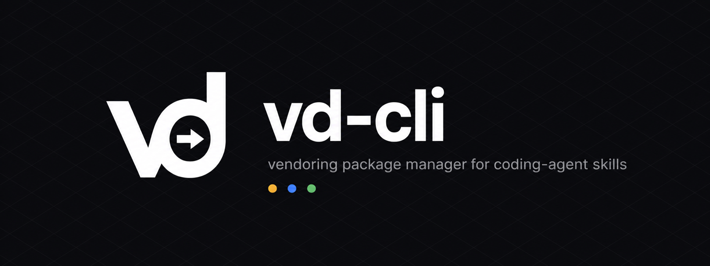

<div align="center">



<br/>

[](https://github.com/vanducng/vd-cli/releases)
[](https://pkg.go.dev/github.com/vanducng/vd-cli/v2)
[](LICENSE)
[](https://github.com/vanducng/vd-cli/actions/workflows/test.yml)

<p>
  <b>vd</b> is a single-binary <i>vendoring</i> package manager for the skills that power your coding agents.
  <br/>
  Skills live in your repo as plain files. <code>vd</code> fetches them from any upstream, locks them with a SHA, and dispatches them to every agent in your stack.
</p>

</div>

---

## Supported agents

`vd` builds a vendor-locked skills tree once and emits the manifest each agent stack expects. Today that's:

| Agent | Status | What `vd build` emits |
|---|---|---|
| **Claude Code** | ✅ first-class | `.claude-plugin/marketplace.json` + `plugin.json` (bundle or per-skill mode) |
| **OpenAI Codex** | ✅ first-class | `.agents/skills/<name>` repo-scope symlinks; `vd install codex` for user scope |

More targets land as the coding-agent ecosystem grows — the emitter interface (`internal/target/iface.go`) is intentionally small so adding a new agent is a single file.

## Why vd-cli

You're already running two or three coding agents. They all want skills but each wants a different layout, a different manifest, a different install path. So you copy-paste between repos, lose track of what came from where, and your agents drift out of sync with their upstreams.

vd-cli flips this:

- **One manifest** — `skills.toml` is the source of truth for which skills, from where, pinned at what SHA.
- **One sync** — `vd sync` fetches atomically, detects local edits before overwriting, populates a deterministic cache.
- **One build** — `vd build` regenerates every agent's manifest byte-for-byte from the lock. No drift between Claude's marketplace.json and Codex's symlinks.
- **No vendor lock-in** — your skills are normal directories on disk. Delete vd-cli and they still work.

## Install

**Homebrew (recommended):**
```sh
brew install vanducng/tap/vd
```

**go install:**
```sh
go install github.com/vanducng/vd-cli/v2/cmd/vd@latest
```

**Pre-built binaries:** see [releases](https://github.com/vanducng/vd-cli/releases) for darwin/linux/windows × amd64/arm64.

**From source:**
```sh
git clone https://github.com/vanducng/vd-cli.git
cd vd-cli
make build && mv vd /usr/local/bin/vd
```

## Quick start

```sh
# 1. Bootstrap a manifest at the repo root
vd init

# 2. Track an upstream skill
vd add browserbase/skills/browser --as browser

# 3. Vendor it locally (fetches, hashes, locks)
vd sync

# 4. Emit manifests for every configured agent
vd build

# 5. (Optional) install local skills into Codex user scope
vd install codex
```

After these five commands:

- `skills/browser/` — the vendored skill source, ready to edit.
- `.claude-plugin/marketplace.json` + `plugin.json` — Claude Code picks it up automatically.
- `.agents/skills/browser` — Codex repo-scope symlink resolves to `skills/browser/`.
- `skills.lock` — pinned commit SHA, content hash, every byte deterministic.

## Commands

| Command | Description |
|---|---|
| `vd init` | Create `skills.toml` at the repo root |
| `vd add <source>/<path>` | Register an upstream skill |
| `vd list` | Print tracked skills as a table |
| `vd sync [skill...]` | Vendor tracked/pinned skills; runs `vd build` |
| `vd update [skill...]` | Bump tracked skills to upstream HEAD |
| `vd diff <skill>` | Diff upstream cache vs local `skills/<name>/` |
| `vd doctor` | Report drift between `skills.lock` and `skills/` |
| `vd pin <skill> <sha>` | Lock a skill to a specific commit SHA |
| `vd detach <skill>` | Stop tracking; leave files on disk |
| `vd remove <skill>` | Remove from manifest, lock, and (default) disk |
| `vd build [target...]` | Emit manifests + symlinks for each agent target |
| `vd install [agent] [skill...]` | Install local skills into Codex or Claude Code user scope |
| `vd cache clean` | Delete the `.vd-cache/` download cache |

Run `vd <command> --help` on any verb for flags, examples, and exit codes.

## Global flags

| Flag | Short | Description |
|---|---|---|
| `--quiet` | `-q` | Suppress non-error output |
| `--verbose` | `-v` | Verbose output (reserved) |
| `--root` | | Override repo root path |
| `--version` | | Print `vd <version>` |

**Repo root resolution:** `--root` flag → `VD_ROOT` env → walk up from CWD to the first `.git/`. Both `--root` and `VD_ROOT` are validated and error out on invalid values.

## Environment

| Var | Effect |
|---|---|
| `VD_ROOT` | Pin a default repo root |
| `VD_NO_UPDATE_CHECK` | Disable the upstream version check |
| `XDG_CACHE_HOME` | Override the cache directory (default `~/.cache`) |
| `CI` | When set, the version check is auto-disabled |

## Version check

vd-cli checks GitHub for new releases at most once per 24 hours and prints a one-line nudge to stderr when a newer version exists:

```
vd 2.0.0 (latest: 2.0.1). Upgrade: brew upgrade vd
```

The check runs in the background and is silent on any failure. Disabled automatically for `dev` builds, when `CI` is set, and when stderr is not a terminal. Set `VD_NO_UPDATE_CHECK=1` to opt out explicitly.

## Documentation

- [Usage guide](docs/usage.md) — core workflows and common commands
- [Command reference](docs/commands.md) — flags, examples, exit codes
- [Config schema](docs/config-schema.md) — every `skills.toml` field
- [FAQ](docs/faq.md) — naming, conflicts, dirty-refuse, design decisions
- [Migration guide](docs/migration.md) — from copy-paste, subtree, or submodules
- [Contributing](CONTRIBUTING.md) — dev setup, release flow, commit style
- [Changelog](CHANGELOG.md) — version history

## License

[MIT](LICENSE) © Duc Nguyen
